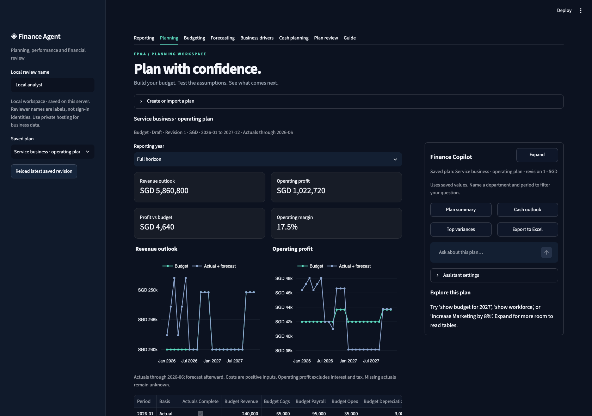
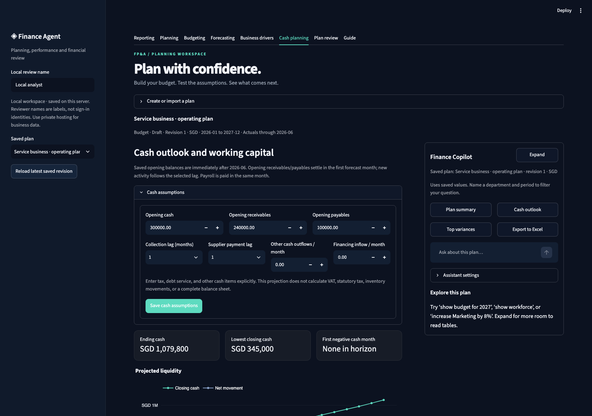
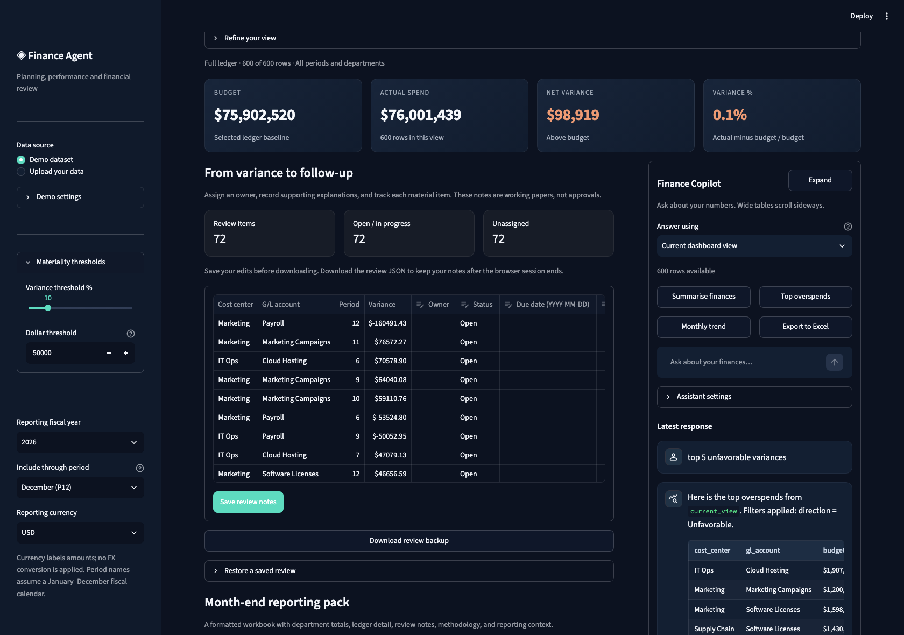
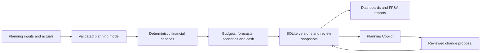
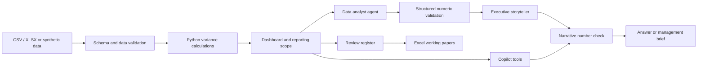

<div align="center">

# AI Finance Agent

### FP&A budgeting, planning, forecasting, and performance analysis

[](requirements.txt)
[](app.py)
[](agents.py)
[](LICENSE)

**Build the plan, explore the outlook, and explain the actual results.**

[Quick start](#quick-start) · [User guide](docs/QUICKSTART.md) · [Planning guide](docs/PLANNING.md) · [Analysis walkthrough](docs/DEMO.md) · [Architecture](docs/ARCHITECTURE.md) · [Data contract](docs/DATA_CONTRACT.md) · [System design](docs/SYSTEM_DESIGN.md) · [Readiness](docs/READINESS.md)

</div>



## The business problem

A month-end variance review involves more than calculating actual spend minus budget. Analysts must check the extract, isolate material movements, explain drivers, follow up with cost owners, and prepare a management pack. Spreadsheet handoffs make it easy to lose the connection between a reported number, its source rows, and the explanation under review.

AI Finance Agent connects budgeting and forecasting with that review workflow. Build departmental budgets, model revenue and staffing, project cash, save scenarios, and compare the outlook with approved targets. A separate actuals workspace investigates expense movements and prepares management reporting. Python calculates the figures; bounded assistants help explore them.

**Application scope:** a local FP&A planning and analysis application with durable planning versions and a supervised review workflow. It includes budgeting, forecasting, scenarios, business drivers, cash projections, and expense investigation. Shared business deployment requires the identity and operational controls described in the [readiness assessment](docs/READINESS.md).

## Planning and forecasting

Choose **Planning** in the top navigation and create the service-business demo, a blank budget, or an imported plan.

| Capability | Implemented behavior |
| --- | --- |
| Budget preparation | Monthly department/account inputs; annual targets allocated using seasonal weights with exact minor-unit reconciliation |
| Revenue planning | Price × volume models with optional monthly volume growth |
| Workforce and capital | FTE, salary, benefits, start/end dates, annual raises, capital purchases, and straight-line depreciation |
| Forecasting | Budget, last-actual, and trailing-three-month baselines; actual-to-forecast splice; rolling versions across calendar years |
| Scenarios | Independent budget/forecast/scenario versions, scoped change previews, and version comparisons |
| Cash planning | Opening cash/AR/AP, receipt/payment lags, payroll, capex, financing, and negative-cash indicators |
| Review workflow | Draft → Submitted → Approved; approved versions locked; revision snapshots and stale-edit protection |
| Planning Copilot | Available on every planning page; scoped reports, follow-ups, Excel downloads, conversation history, full-width reading, optional intent routing, and budget/forecast what-ifs with profit and cash impacts |
| Reporting and portability | Monthly P&L, Budget–Actual–Forecast detail, FP&A workbook, JSON backup/restore, and CSV inputs |

Planning versions persist in a local SQLite database. Review names are labels, not authenticated identities; all sessions on one deployment share the planning store. Keep business plans on protected local/private infrastructure. See the [planning user guide](docs/PLANNING.md) for calculations, controls, and the input contract.



## Actuals and investigation

| Workflow | Implemented behavior | Business purpose |
| --- | --- | --- |
| Load an extract | CSV/XLSX validation, monthly-grain duplicate checks, finite numeric amounts, single reporting currency | Catch input problems before they become misleading totals |
| Set reporting scope | Select a fiscal year, last included period, cost centers, accounts, quarters, and direction | Keep dashboards, working papers, and commentary aligned |
| Review performance | KPIs, monthly budget/actual trend, department comparisons, reconciled variance bridge | Move from overall position to the drivers behind it |
| Prioritize exceptions | Configurable percentage **or** amount thresholds; automatic flags for unbudgeted activity | Make the review queue explicit and consistent |
| Investigate with Copilot | Suggested questions, scoped answers, follow-ups, period comparisons, and Excel extracts | Reduce repeated filtering and report preparation |
| Record follow-up | Owner, status, due date, explanation, and next action for each material row | Support an analyst's month-end working paper |
| Preserve a review | JSON backup tied to the ledger's keys, amounts, and currency | Restore notes against the same source data |
| Produce a reporting pack | Styled Excel workbook with department summary, ledger, review register, methodology, and context | Give reviewers an inspectable handoff |
| Draft a management brief | Deterministic or optional LLM commentary; Markdown/PDF downloads | Prepare a first draft supported by calculated figures |



## Quick start

Use **Python 3.11**. Clone or download this repository, then open a terminal in its root folder:

```bash
python3 -m venv .venv
source .venv/bin/activate
python -m pip install -r requirements.lock.txt
streamlit run app.py
```

On Windows PowerShell, activate with `.venv\Scripts\Activate.ps1` instead. The dashboard opens at **http://localhost:8501**.

**No API key is needed.** Both workspaces run locally. Planning includes a **24-month synthetic service-business plan** with six closed months and 18 future months. The actuals demonstration contains **600 synthetic monthly records** across 5 cost centers, 10 accounts, and 12 periods.

The top navigation shows **Reporting · Planning · Budgeting · Forecasting · Business drivers · Cash planning · Plan review · Guide**. Select **Planning → Create or import a plan → Create demo plan**. Copilot is available beside every planning page: try `show budget for 2026`, `what about 2027?`, then `export that to Excel`. Ask `What if I increase Marketing budget by 8% for next month?` to preview the budget effect and a separate spending/cash illustration. The resolved date is shown. Nothing changes until you review and apply the requested field; use `October 2026` for a date-stable demo. See the [user guide](docs/QUICKSTART.md) or [complete planning walkthrough](docs/PLANNING.md).

For a smaller, reproducible business scenario, upload [the 18-row SGD sample](examples/monthly_budget_actuals.csv) and follow the [five-minute demo](docs/DEMO.md).

To generate a sample reporting pack without the UI:

```bash
python scripts/demo_report.py
python scripts/demo_plan.py
```

The command writes a synthetic working paper under `outputs/`, which is excluded from Git.

## A typical actuals review workflow

1. **Load and validate.** Export monthly Budget vs Actual balances from your finance system, aggregated to the required grain. Upload the file; correct any validation errors in the source.
2. **Choose the reporting boundary.** Select one fiscal year and the last posted period. Confirm the reporting currency. Currency selection labels amounts; it does not convert them.
3. **Assess the position.** Review the overview, monthly trend, and budget-to-actual bridge. Switch to material variances when investigating exceptions.
4. **Investigate.** Use the ledger or Copilot to identify a driver, compare periods, or download supporting rows. Account names alone do not establish a root cause.
5. **Document follow-up.** Assign owners and record explanations in **Review & export**. Resolving an item requires an owner and an explanation; it does not constitute formal approval.
6. **Prepare the handoff.** Generate an executive brief, save review notes, and download the reporting pack and JSON backup. Have a finance reviewer validate the conclusions against supporting evidence.

## Actuals Copilot examples

Replies open beneath the question box in a naturally expanding area. Wide tables stay contained within the reply and scroll horizontally. Earlier exchanges stay in a collapsible history. Select **Expand** for full-width tables and **Back to dashboard** to return; your conversation, scope, and downloads are preserved. [See the expanded Copilot](docs/images/copilot.png).

| Ask | Expected workflow |
| --- | --- |
| `summarise finances` | Budget, actual, net variance, and leading movements for the chosen scope |
| `top 5 unfavorable variances` | Ranked adverse movements with calculated values |
| `compare budget vs actual for Finance by account` | Department/account breakdown |
| `what about March?` | Follow-up that preserves the previous user-selected topic |
| `export that to Excel` | Workbook for the inherited scope |
| `what changed between January and March?` | Two-period movement analysis; both periods must exist |
| `export biggest variance investigation to Excel` | Investigation workbook with explicitly labeled wider-period supporting detail |
| `what columns must I upload?` | Required schema and upload guidance |
| `convert 100 USD to SGD` | Optional public FX lookup; reports the observation date and source |

**Answer using** sets the default to the dashboard view or full reporting ledger. Explicit scope requests can override that default. The full ledger is still limited to the selected fiscal year and reporting cutoff. Changing the data, filters, or thresholds clears stale conversations, exports, and briefings. Review notes survive filter changes and are reset when the underlying ledger changes.

Local chat is a defined set of business-language routes, not a general-purpose reasoning model. For historical files, explicit months and periods are preferable to relative phrases such as “last month.” Relative phrases use the server's calendar date and reject a mismatched reporting year.

## How the application is built

The application is a Python modular monolith with separate planning services, persistence, UI, and analysis modules:



Planning amounts are stored in integer minor units after explicit two-decimal rounding. Saved versions carry their source, assumptions, and revisions. Planning Copilot parses explicit report scopes and validated follow-up context. Optional model routing returns only a report identifier; calculations remain local. Exact change commands require a preview and explicit save. The separate tool-backed model workflow below supports actuals investigation and briefings.

## How the AI is controlled



- **Deterministic calculations:** incoming variance columns are recalculated from budget and actual. Uploaded amounts are normalized to two decimal places.
- **Structured output:** Pydantic validates agent payloads; the analyst's returned totals, counts, classifications, and driver values are compared with the calculated reference.
- **Tool-backed chat:** models receive a bounded set of data tools. There is no arbitrary Python execution tool.
- **Narrative checks:** significant numbers in generated chat and executive commentary are checked against trusted results. A failed check falls back to the local answer or briefing.
- **Evidence boundaries:** absent root-cause evidence remains unknown. Source-supplied labels are described as assertions requiring validation.
- **Bounded requests:** strict tool arguments, requested entity/period checks, limited call/history budgets, provider timeouts, and capped session artifacts.
- **Fallbacks:** the application remains useful without credentials or when a provider fails. See the [Copilot reliability guide](docs/COPILOT.md).

The narrative check is a lexical numeric check, not proof that a statement is semantically correct. It does not certify causality, accounting treatment, completeness, or approval. See [architecture and tradeoffs](docs/ARCHITECTURE.md).

## Actuals financial conventions

```text
Variance        = Actual − Budget
Variance %      = (Actual − Budget) / Budget × 100
Material row    = |Variance %| > threshold OR |Variance| > threshold
                  OR Budget = 0 and Actual ≠ 0
```

Positive variance is unfavorable for **expense accounts**; negative variance is favorable; zero is on budget. Zero-budget percentages are undefined and displayed as N/A or blank in exports. Credits are retained. Thresholds are strict `>` comparisons, not `>=`.

The actuals investigation workspace uses expense variance semantics and floating-point reporting calculations. The planning workspace separately supports revenue and expense categories, integer-minor-unit calculations, and cross-year horizons. Neither workspace performs FX translation or journal posting; non-calendar fiscal mapping requires an extension. See the [planning conventions](docs/PLANNING.md).

## Optional provider setup

Copy `.env.example` to `.env` and configure an enabled provider and model. Keep credentials out of Git. Open **Assistant settings** or **Commentary provider** to select the provider; local mode remains the default.

```bash
cp .env.example .env
```

The OpenAI and Anthropic integrations use LangChain adapters. Provider access, model availability, and usage charges belong to your provider account. Live-provider behavior is not covered by the offline tests; those tests use mocks. The [deployment guide](docs/DEPLOYMENT.md) explains environment variables and data handling.

Local analysis stays in the app process. Selecting an external provider can send questions, chat history, and requested data-tool results to that provider. FX lookups contact a public rate service. Use synthetic data for a public demo.

## Engineering and verification

```bash
python -m pip check
python scripts/check_repository.py
python -m unittest discover -s tests -v
```

The recorded release passes **213 offline tests**. The suite covers financial calculations, malformed inputs, missing actuals, allocation rounding, revenue/workforce/capital drivers, cash reconciliation, forecast evaluation, scenario scope, review locks, persistence, stale-edit conflicts, backup restore, spreadsheet exports, provider fallbacks, and Streamlit interactions.

[GitHub Actions](.github/workflows/ci.yml) runs the offline suite and dependency checks on pushes and pull requests. A configured workflow is not a claim that a hosted CI run has already passed. The [validation record](docs/VALIDATION.md) distinguishes local checks from services that have not been exercised.

| Technology | Responsibility |
| --- | --- |
| Python, pandas, NumPy | Ledger validation, aggregation, variance calculations |
| Streamlit, Plotly | Planning workspace, investigation dashboard, controls, charts, and review UI |
| SQLite, Python Decimal | Persistent plan revisions and explicit monetary input rounding |
| LangGraph | Explicit analyst → storyteller workflow |
| LangChain | Optional provider adapters and bounded tool calling |
| Pydantic | Structured agent schemas and finite-value validation |
| openpyxl, ReportLab | Excel working papers and PDF briefings |
| unittest, Streamlit AppTest | Calculation, integration, and UI regression tests |

<details>
<summary>Repository layout</summary>

```text
app.py                 Workspace navigation and actuals reporting controls
epm.py                 Planning contract, financial models and scenarios
epm_store.py           SQLite storage, review locks, revision snapshots and backups
epm_ui.py              Planning workbenches and shared expandable Copilot
planning_chatbot.py     Scoped planning reports, follow-ups, exports and safe routing
planning_whatif.py      Budget/forecast previews, date resolution, profit and cash effects
agents.py              Analyst/storyteller workflow and structured validation
chatbot.py             Tool routing, conversation context, and data questions
data_engine.py         Upload validation, demo data, and materiality rules
guardrails.py          Deterministic recalculation and response checks
dashboard.py           Chart calculations and stale-result invalidation
review.py              Review register, backup/restore, reporting pack
exports.py             Spreadsheet formatting and literal text handling
reporting.py           Reporting currency and shared formatting
prompts.py             Provider instructions and tool descriptions
examples/              Synthetic business sample
docs/                  User workflow, system design, data contract, deployment
scripts/               Synthetic actuals/planning reports and repository checks
tests/                 Offline regressions and Streamlit interaction tests
.github/               CI and contribution templates
```

</details>

## Scope and next steps

The application supports a local FP&A workflow. Planning versions and review events persist in SQLite; actuals exception notes remain session-based unless exported. Local planning approvals are workflow states, without authenticated reviewers or segregation of duties. The app does not implement tenant authorization, tamper-proof audit history, ERP writeback, group consolidation/eliminations, full balance-sheet modeling, or statutory tax calculation. Upload limits are resource guards, not throughput benchmarks.

A deployment with confidential business data would need an approved hosting environment, identity and access controls, retention policies, provider governance, monitoring, and workload testing. The next engineering extensions are authenticated roles, protected shared storage and recovery, explicit fiscal calendars, and live-provider evaluation. The [planning guide](docs/PLANNING.md) documents the implemented financial model and its boundaries.

The [system design guide](docs/SYSTEM_DESIGN.md) explains how the application is built, traces a request through the code, and documents AI orchestration, failure handling, and engineering tradeoffs. See the [readiness assessment](docs/READINESS.md) for deployment priorities. Contributions are described in [CONTRIBUTING.md](CONTRIBUTING.md); data handling is documented in [SECURITY.md](SECURITY.md).

Licensed under [MIT](LICENSE). All committed examples and screenshots use synthetic data.
