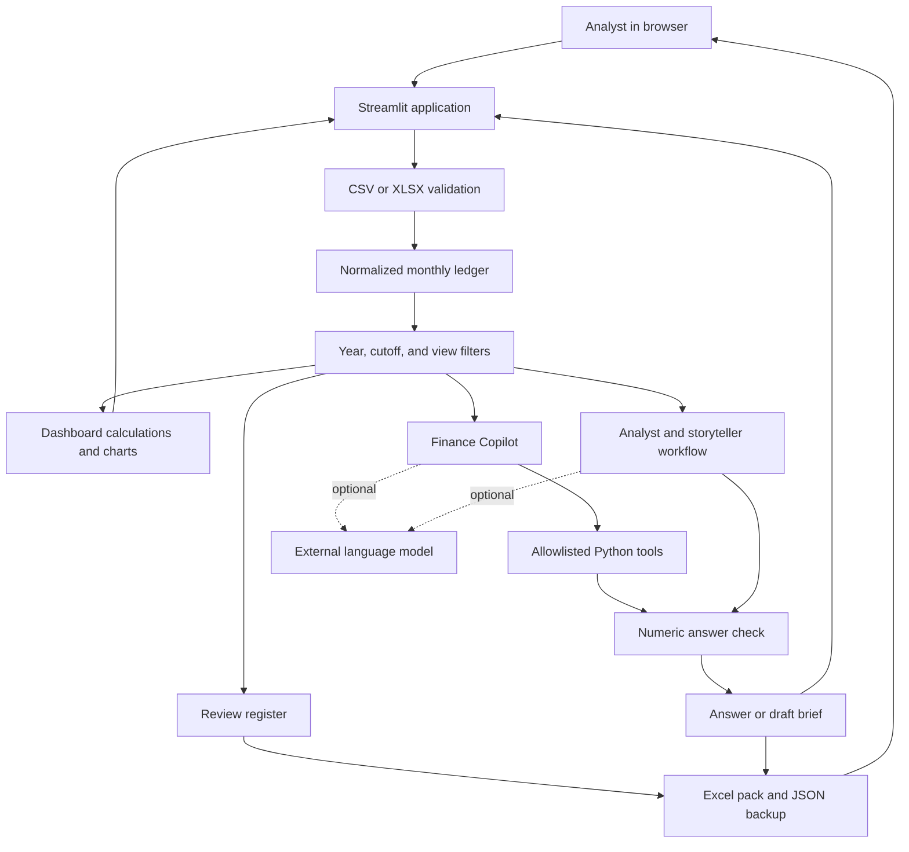
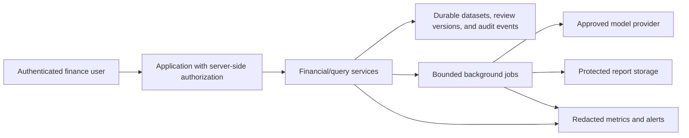

# System design and implementation

This guide describes the actuals investigation and AI architecture, with a planning extension described below. The [planning guide](PLANNING.md) covers budgeting, forecasting, scenarios, business drivers, cash, and persistent versions. **Implemented** describes current behavior; **proposed** describes future work. Read it alongside the [demo](DEMO.md), [architecture](ARCHITECTURE.md), [data contract](DATA_CONTRACT.md), and [readiness assessment](READINESS.md).

## 1. What problem does the application solve?

A finance analyst receives a monthly Budget vs Actual extract. They need to identify significant expense movements, investigate supporting rows, ask cost owners for explanations, and prepare a management report. That work is often spread across spreadsheets, messages, and separate presentation files.

The application connects those tasks in one supervised workspace:

```text
Load monthly ledger → validate → set reporting scope → investigate
                    → assign follow-up → export review pack
```

The main outputs are a dashboard, scoped chat answers, an exception register, Excel working papers, and a draft executive briefing. The analyst still checks source completeness, obtains evidence, and decides actions.

The design combines deterministic expense calculations, a tool-calling AI copilot, and a traceable month-end review workflow. The included examples are synthetic; production workload validation is still required.

## 2. The system as it exists today

It is a **modular monolith**: one Python application/process with different responsibilities organized into modules. The browser displays a Streamlit interface. The Python server owns the dataframes, runs calculations and tools, manages temporary session state, and creates exports. Optional model requests go from that server to the selected provider.



The diagram shows logical responsibilities, not separate deployed services. There is no custom REST API, task queue, vector database, or ERP connector. The planning workspace now uses a local SQLite database shared by sessions; the actuals workflow described in this diagram retains session-based review state. LangGraph's installed checkpoint package does not mean persistence is enabled: `build_graph()` compiles the workflow without a persistent checkpointer.

## 3. Module responsibilities

| File | Responsibility | What to look for |
| --- | --- | --- |
| [data_engine.py](../data_engine.py) | Data contract, demo ledger, variance and materiality calculations | `_read_ledger`, `_validate_budget_actuals_frame`, `calculate_variances`, `filter_significant_variances` |
| [dashboard.py](../dashboard.py) | Chart data and stale-output invalidation | `refresh_context`, `monthly_summary`, `reconciled_waterfall` |
| [app.py](../app.py) | User interface and workflow wiring | `main`, `render_workspace`, `render_data_chatbot`, `render_review_workspace` |
| [chatbot.py](../chatbot.py) | Local language routes, model/tool loop, context, exports | `answer`, `_answer_locally`, `_answer_with_llm`, `_build_tools`, `_memory_context` |
| [agents.py](../agents.py) | The two-step management briefing workflow | `AgentState`, `build_graph`, `_build_deterministic_analysis`, `_analyst_numbers_match` |
| [guardrails.py](../guardrails.py) | Reference calculations and output checks | `calculate_exact_variances`, `validate_response_against_dataframe` |
| [review.py](../review.py) | Follow-up state and source-bound backups | `ledger_id`, `validate_notes`, `restore_review`, `month_end_pack` |
| [exports.py](../exports.py) | In-memory workbook creation and literal spreadsheet text | `csv_bytes`, `format_workbook`, `workbook_bytes` |
| [reporting.py](../reporting.py) | Scoped reporting-currency formatting | `reporting_currency`, `money`, `percentage` |
| [prompts.py](../prompts.py) | Instructions and descriptions supplied to optional models | `SYSTEM_PROMPT`, `TOOL_DESCRIPTIONS` |
| [tests](../tests) | Executable examples of expected behavior | Read the test names, then the small fixtures and assertions |

A DataFrame is a table held in Python memory. JSON is a structured representation used to pass fields between components. Pydantic checks whether those structured fields obey the expected schema. A schema is a data contract, not a guarantee that a paragraph is true.

## 4. Follow one real example through the system

Use the committed [synthetic SGD sample](../examples/monthly_budget_actuals.csv). March contains these two IT Ops records:

| Account | Budget | Actual | Variance |
| --- | ---: | ---: | ---: |
| Cloud Hosting | 20,000 | 25,500 | 5,500 |
| Software Licenses | 8,000 | 8,200 | 200 |
| IT Ops total | 28,000 | 33,700 | 5,700 |

For Cloud Hosting, variance percentage is `5,500 / 20,000 × 100 = 27.5%`. For the department, it is `5,700 / 28,000 × 100 ≈ 20.36%`. Calculate the percentage from aggregate amounts; do not simply average row percentages.

When the user asks `compare budget vs actual for IT Ops in March by account`:

1. The reporting ledger is already restricted to the selected year and cutoff.
2. Copilot recognizes IT Ops, March/P03, and an account breakdown.
3. The selected data source and recognized filters constrain the data operation.
4. Python selects those rows and performs the arithmetic.
5. Local routing formats the result, or an optional model uses allowed tools and drafts an answer that passes the numeric check.
6. `export that to Excel` inherits the user's context and creates the corresponding workbook.

The source sample totals are SGD 226,000 budget, SGD 255,300 actual, and SGD 29,300 unfavorable variance. These are demo control totals, not evidence of business savings.

## 5. Why data validation comes before AI

The required grain is one row per **fiscal year, period, cost center, and G/L account**. A primary-key-like combination identifies the balance being reviewed. Repeating an account's full monthly budget on every invoice line would inflate the budget when summed; the app therefore expects an already aggregated monthly extract.

Validation rejects missing fields, duplicate raw headers/aliases, duplicate monthly keys, blank dimensions, invalid/nonfinite amounts, invalid periods/years, and mixed currencies. Incoming derived variance fields are recalculated. Missing amounts do not become zero.

The important conventions are:

- `variance = actual − budget`; positive is unfavorable for expense accounts.
- A zero budget makes the percentage undefined. Nonzero actual activity against zero budget is still flagged.
- Materiality is absolute percentage **or** absolute amount strictly greater than the threshold, plus unbudgeted activity.
- Negative balances are retained; this is an expense-reporting convention, not a complete revenue/expense accounting model.
- One reporting currency is used at a time. Choosing SGD changes denomination labels, not the underlying amount.
- Calendar month names assume periods 1–12 map to January–December.

The actuals monetary implementation uses floating-point arithmetic with reporting rounding. The separate planning engine stores integer minor units after explicit Decimal rounding. It does not have the guarantees of a Decimal-based posting ledger. A production accounting boundary would need a consistent precision and rounding policy.

The upload guards are 20 MB in the UI and 100,000 monthly rows. They are limits on accepted input, not a benchmark proving acceptable speed or memory at those limits.

## 6. What makes the dashboard reliable?

The charts, KPIs, chat sources, and report generation derive from the reporting ledger and selected view. Filtering therefore changes the business question being answered.

`refresh_context()` compares a fingerprint of the data/view context. When that context changes, it clears stale conversations, generated briefings, and exports. Otherwise, a previously generated all-company answer could remain visible beside a Finance-only chart.

The variance bridge must reconcile: starting budget plus displayed movements plus any residual equals actual. Showing only the largest drivers without the remainder would create a visually appealing but incomplete reconciliation.

Currency formatting uses `ContextVar`, which scopes a value to the active execution context and restores it afterward. This avoids relying on one mutable global currency setting. It is not authentication or proof of multi-user isolation under every deployment configuration.

Streamlit reruns application code as users interact. Session state retains the working context across those reruns. It is temporary connection-associated state, rather than durable business storage; the official [Session State documentation](https://docs.streamlit.io/develop/api-reference/caching-and-state/st.session_state) explains its lifecycle.

## 7. AI integration

The implementation provides **application logic, orchestration, tools, validation, and user workflows around existing language models**. Uploaded spreadsheets supply runtime data for analysis. The application does not train or fine-tune the underlying models.

There are two modes:

**Local mode:** rule-based language recognition selects Python operations and deterministic response templates. It works without a model key and supports the documented business routes. It cannot interpret every phrasing or perform arbitrary reasoning.

**Optional model mode:** the selected provider receives instructions, recent conversation messages, tool definitions, and requested tool results. It proposes allowed operations and drafts the response. The application still decides whether the proposed tool arguments and final numbers are acceptable. Some requests deliberately use local routing even with a provider selected; selecting a provider does not mean every answer is generated by it.

There is no embedding index, semantic document retrieval, or vector database. Consequently, this is not a conventional document-RAG application. Its grounding comes from direct structured-data operations. If future requirements include contracts or invoices, document retrieval with citations could be a separate extension.

## 8. Tool execution

A tool is a named Python function with an input schema and a defined result. It is not a second AI model.

For an illustrative request about IT Ops in March, the model might propose:

```json
{
  "name": "calculate_variance_metrics",
  "args": {
    "source": "current_view",
    "cost_center": "IT Ops",
    "period": 3,
    "group_by": "total"
  }
}
```

The application looks up the tool in an allowlist, checks argument structure and requested scope, runs Python, and returns the result to the model. Unknown tool names and unexpected schema fields are rejected. Data filters use normalized exact equality for entities.

Available operations include profiles, filtered previews, aggregation, variance metrics, period comparisons, investigation workbooks, generic exports, glossary/schema help, and optional FX queries. There is no arbitrary shell, Python execution, unrestricted URL fetch, or accounting transaction tool exposed to the model.

A fixed function interface reduces the consequences of an incorrect model decision. This is consistent with OWASP's guidance to limit tool capabilities and privileges in [Excessive Agency](https://genai.owasp.org/llmrisk/llm062025-excessive-agency/). It is not a claim of OWASP certification.

Optional FX queries use a fixed public rate service and report the observation/source. They do not translate the uploaded ledger or execute a trade.

The tool loop executes synchronously. Its resource controls include a 4,000-character question, limited recent history, four tool-calling rounds, eight tool calls, a result-size limit, and provider timeouts. The 120-second budget is checked between operations; it cannot interrupt every in-flight operation. The UI retains 40 messages and five referenced Excel downloads. These controls do not provide account-level rate limits or a global cost cap.

## 9. Briefing agents and LangGraph

The actual briefing graph is:


The analyst first builds a deterministic reference: totals, materiality counts, department summaries, and drivers. Optional model enrichment must retain checked numerical and identity fields. The storyteller drafts narrative from the validated analysis; a failing numeric check retains the deterministic brief.

`AgentState` is the structure passed between graph nodes. It contains records, settings, analysis, narrative, and errors. A node is a function that reads state and returns updates. Edges define the sequence. The graph is fixed: analyst, then storyteller, then end.

The labels `Excel_Report_Agent` and `Variance_Investigation_Agent` in Copilot responses are routing labels, not separately running autonomous workers. The [LangGraph documentation](https://docs.langchain.com/oss/python/langgraph/workflows-agents) distinguishes predefined workflows from agents that dynamically choose operations. This project contains a fixed briefing workflow and a bounded tool-calling chat loop.

LangChain supplies provider/tool interfaces; LangGraph makes the workflow state and transitions explicit. A sequential fallback retains the briefing interface if LangGraph is unavailable. Neither library automatically supplies the application with authentication, production storage, or validated business reasoning.

A fair design critique: the optional analyst model call may add limited value because its numbers already exist in Python and must not change. A measured future simplification could keep the analyst entirely deterministic and reserve model calls for useful narration or evidence retrieval.

## 10. What do the guardrails guarantee?

They check particular conditions, not overall truth.

| Layer | Example check | Remaining limitation |
| --- | --- | --- |
| Input contract | Budget is numeric and required dimensions exist | The extract might still omit a legitimate expense |
| Deterministic calculation | Variance is recalculated from actual/budget | Incorrect source postings remain incorrect inputs |
| Tool schema | Period 13 or an unexpected argument is rejected | Valid arguments may still represent a misunderstood request |
| Scope checks | Recognized Finance/March filters cannot be silently dropped by the model | Language recognition is bounded and not exhaustive |
| Analyst comparison | Returned numbers, counts, classifications, and identities match the reference | Narrative evidence and recommendations need review |
| Narrative number check | An unsupported recognizable amount triggers fallback | A real amount can be attributed to the wrong department |
| Failure fallback | Provider errors leave core supported routes available | Unsupported local questions may still require clarification |

For example, if 25,500 appears in a valid IT Ops tool result, a narrative that wrongly assigns it to Finance may still pass numeric membership checking. This is why “hallucination-proof” or “100% accurate” would be an incorrect claim.

Similarly, higher Cloud Hosting spend does not prove a vendor price increase. Usage, timing, reclassification, or an input error could explain it. Source-supplied categories are assertions requiring evidence. Unknown causes should remain unknown.

Earlier assistant messages remain assistant-role messages; they are not promoted to system instructions. Only user messages supply inherited filter context. Prompts tell the model to treat ledger descriptions as untrusted data. These are defenses against some failure paths, not proof that prompt injection is solved.

## 11. Why the review register and exports matter

Analysis becomes operationally useful when someone owns the follow-up. The review register records owner, status, due date, explanation, and next action. Financial source fields are read-only. Resolved items require an owner and explanation, including rejecting null values that might otherwise look like text.

A SHA-256 ledger fingerprint binds the backup to sorted source keys, amounts, and currency. Reordering rows is acceptable; changing the identified source values requires a different review. This detects accidental source mismatch. It is not a digital signature, authenticated authorship, or an immutable audit trail, and it does not cover every optional note field.

The month-end pack includes department totals, ledger rows, review notes, methodology, report context, and a management brief when available. Generic chat extracts have summaries/profiles that reconcile to their detail. Investigation/comparison workbooks may deliberately include separately described wider-period supporting sheets.

CSV formula-like strings are neutralized, and Excel formula-like source text is stored as literal text. That prevents an uploaded description beginning with a formula character from becoming an executable formula in these exports. It is not a guarantee about every spreadsheet opened outside this workflow.

Excel, JSON, Markdown, and PDF are portable handoff formats. They do not provide collaborative synchronization, approval enforcement, or disaster recovery by themselves.

## 12. Testing and what the evidence means

The current offline suite contains 213 passing tests, including planning calculations, cash, persistent versions, review locks, and planning UI workflows. Coverage includes calculations, malformed uploads, zero budgets, ambiguous scopes, missing periods, mocked provider failures, numerical checks, workbook content, review restore, and Streamlit interaction behavior.

**Mocks** simulate a provider returning a tool call, an invalid answer, or an exception. They make regressions repeatable and avoid paid requests in CI. They do not measure how reliably a live model understands actual questions.

**AppTest** exercises the Python/Streamlit interaction model. It does not prove that a table fits the visible browser panel. The chat overflow bug illustrates this distinction: behavioral tests passed, while the rendered table still escaped its container. Browser checks now inspect actual panel/table geometry and confirm that horizontally hidden columns remain reachable.

The configured CI installs dependencies, checks the repository, and runs offline tests. A CI configuration file is not a successful hosted CI run. A container definition is not a tested container deployment. Dependency consistency is not a vulnerability audit.

Before live business use, evaluate each enabled model against reviewed fixtures. Measure correct scope, correct values, numerical attribution, unsupported causal claims, fallback rate, latency, and cost. Test multiple sessions, cancellation, retained data, and failures in the real hosting environment.

## 13. Why these technologies, and what would change?

| Choice | Why it fits this release | Tradeoff / next decision |
| --- | --- | --- |
| Streamlit | Builds Python data workflows with upload, charts, tables, forms, and downloads in one app | Detailed layout control and durable session handling need care |
| pandas/NumPy | Explicit, inspectable tabular transformations | Data copies/exports consume process memory; benchmark before scaling |
| Plotly | Interactive finance charts and hover context | Visual reconciliation still depends on correct data preparation |
| Pydantic | Rejects malformed structured input/output | Schema validity is not semantic correctness |
| LangChain | Common model and tool integration interfaces | Adds dependencies and changing adapter behavior to validate |
| LangGraph | Makes the analyst/storyteller sequence explicit | The small fixed workflow could also use ordinary sequential Python |
| Python modules in one app | Simple to run, debug, and demonstrate | UI, routing, provider work, and exports need cleaner boundaries as scope grows |
| Actuals session state + JSON backup | Simple working-paper workflow | Actuals review notes require exported backups |
| Planning SQLite versions | Durable local plans with atomic revisions and snapshot history | No authenticated roles, tenant isolation, or tamper-resistant audit guarantee |
| Pinned packages and CI | Reproducible baseline and automated regressions | Versions still need maintenance; pinning alone does not prove safety |

The current chatbot module is over 3,600 lines and combines parsing, context, provider execution, data tools, exports, and presentation. The app module is about 1,000 lines. File length is not itself a correctness failure, but it makes changes harder to isolate and review.

A useful refactor would separate query/context resolution, financial services, provider orchestration, exports, and presentation. Add a typed result carrying dataset identity, scope, entity, period, metric, value, and currency. That would make it easier to validate attribution rather than merely recognize a number in prose.

There are also multiple variance/validation representations, including a legacy field named `Variance_USD` used as a nominal variance field. That name does not convert amounts into USD. Consolidating calculation/precision rules and currency naming would improve clarity before extending the system.

## 14. A proposed production evolution

This is a future design, not functionality already implemented:



The first production work is identity and access control, durable review records, approved data handling, live-model evaluations, and operational controls. Use explicit dataset ownership and revision identifiers. Provider access should be bounded by user and application budgets. An authenticated gateway can protect access, but authorization still needs to be enforced at the data operation when roles or tenants differ.

Do not assume microservices, Kubernetes, extra agents, or a vector database are required. Introduce components when workload, reliability, or ownership requirements justify their cost. The planning extension introduces separate financial services, persistence, and UI modules with local SQLite storage. Shared production deployment still requires identity, protected storage, authorization, and operational acceptance.

Production acceptance should include user isolation, recovery from restarts, concurrent edits, successful backup restore, reporting reconciliation, live-model quality, cancellation, overload behavior, and known latency/cost targets. See [READINESS.md](READINESS.md).

## 15. Planning extension

The planning workspace adds a second data contract: calendar month × department × account, with a category and separate budget/actual/forecast values. Its monetary fields use integer minor units. Reports splice actuals through the close with forecasts afterward, keep missing actuals unknown, and use category-aware favorable/unfavorable impact.

Business models include annual budget allocation, revenue price × volume, workforce timing/benefits/raises, capital depreciation, forecast baselines, scenario adjustments, and cash timing. `epm.py` returns new plan values without mutating the input. `epm_store.py` persists a validated version and review snapshot in one SQLite transaction. Expected revision numbers prevent lost updates. `epm_ui.py` provides the planning workflow and a planning Copilot whose proposed changes require explicit application.

A database snapshot is durable local history, not authenticated authorship. Approved versions are locked through application operations; someone with direct database access can alter the store. Plan backups restore as new drafts and cannot import approval privileges. The complete financial assumptions and operating boundaries are documented in [PLANNING.md](PLANNING.md).
